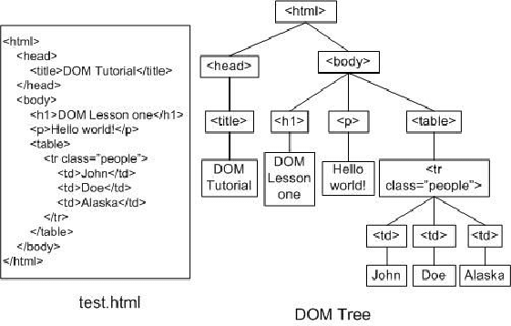

The HTML is represented(constructed) as a tree of object which called DOM model:

basic :-
console.log()
document.write()
alert()

### document - it represent All HTML of web page

Methods : 
- getElementById
- getElementsByClassName
- getElementsByTagName
- getElementsByName

Property
- element.innerHTML = new html
- element.getAttribute('attribute name')
- attribure method : element.setAttribute(attribute, value)
- element.style.property = new style

User Input:
- prompt()  `for user input any value and this need's type conversion if we are getting other then string`
- confirm()  `for true and flase` 

### window : represents the browser window,  It is the global object
- window.document.getElementById("")  // `document object is also come under window object`
